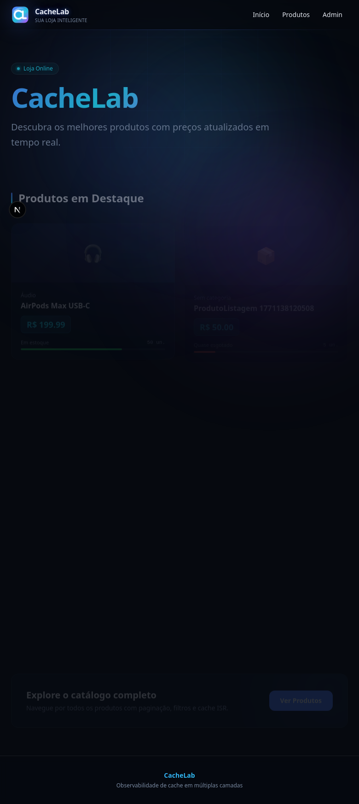

<h1 align="center">
  
  <br />
  CacheLab
</h1>

<p align="center">
  
  
  
  
  
  
  
</p>

<p align="center">
  Mini e-commerce em Next.js 16 para experimentar <strong>caching em múltiplas camadas</strong>.
</p>

<p align="center">
  
</p>

---

## 📚 Sobre o projeto

CacheLab é uma loja online fictícia construída para estudar e demonstrar estratégias de cache no ecossistema Next.js. O projeto implementa **quatro camadas de cache** que funcionam em conjunto:

| Camada | Onde | Como |
|--------|------|------|
| **Next.js Data Cache** | Servidor (RSC) | `"use cache"`, `cacheLife()`, `cacheTag()` |
| **Invalidação explícita** | Server Actions | `revalidatePath()`, `revalidateTag()` |
| **HTTP / CDN** | API Routes + Edge | `Cache-Control`, `s-maxage`, `stale-while-revalidate` |
| **Client-side** | Hooks React | Cache em memória com TTL configurável |
| **State (Zustand)** | Client (persist) | Carrinho persistido em `localStorage` |

O painel admin permite criar produtos, alterar preços/estoque e observar em tempo real como cada camada reage às mutações. Há também um **carrinho de compras** com checkout simulado que demonstra a invalidação de cache após mutações (vendas).

Além do fluxo de cache, o app já inclui **metadata routes para SEO técnico**:
- `src/app/robots.ts` com regras por ambiente (produção vs preview/dev)
- `src/app/sitemap.ts` com geração dinâmica de URLs estáticas e produtos paginados

## 💻 Pré-requisitos

É necessário ter instalado na sua máquina:

- [Git](https://git-scm.com)
- [Node.js](https://nodejs.org/) (v22.12.0 — veja `.nvmrc`)
- [pnpm](https://pnpm.io/) (recomendado via Corepack: `corepack enable`)
- Uma instância [Supabase](https://supabase.com/) com banco Postgres

## 🚀 Como executar o projeto

```bash
# Clone este repositório
$ git clone https://github.com/VitorFirmino/cachelab.git

# Acesse a pasta do projeto
$ cd cachelab

# Instale as dependências
$ pnpm install

# Copie as variáveis de ambiente
$ cp .env.example .env
```

Preencha o `.env` com no mínimo:

| Variável | Descrição |
|----------|-----------|
| `NEXT_PUBLIC_SITE_URL` | URL canônica do site (usada em `robots` e `sitemap`) |
| `NEXT_PUBLIC_SUPABASE_URL` | URL do projeto Supabase |
| `NEXT_PUBLIC_SUPABASE_PUBLISHABLE_DEFAULT_KEY` | Chave pública (ou `ANON_KEY`) |
| `DATABASE_URL` | Connection string do Postgres (para Prisma) |
| `ADMIN_EMAILS` | E-mails com acesso ao painel admin |

Veja todas as variáveis disponíveis em [`.env.example`](.env.example).

```bash
# Prepare o banco de dados
$ pnpm prisma migrate dev --name init
$ pnpm prisma generate
$ pnpm seed

# Execute em modo desenvolvimento
$ pnpm dev
```

O servidor iniciará na porta **3000** — acesse `http://localhost:3000`

Para validar cache como em produção:

```bash
$ pnpm build && pnpm start
```

## 📚 Conceitos Aplicados

- **`"use cache"` directive** — Cache no servidor via React Server Components
- **`cacheLife()` / `cacheTag()`** — Perfis de TTL e tags para invalidação granular
- **`revalidatePath()` / `revalidateTag()`** — Invalidação explícita via Server Actions
- **Cache-Control headers** — `s-maxage`, `stale-while-revalidate` nas API Routes
- **Edge Functions** — Lógica no edge (Supabase/Deno) com cache HTTP
- **Client-side caching** — Hooks React com cache em memória e TTL configurável
- **Zustand + persist** — Carrinho de compras persistido em `localStorage`
- **Server Actions** — Checkout transacional com validação de estoque e invalidação de cache
- **Cache observability** — Dashboard admin para monitorar e ajustar TTLs em tempo real

## 🧭 Rotas

| Método | Rota | Descrição |
|--------|------|-----------|
| GET | `/` | Home com produtos em destaque |
| GET | `/products` | Catálogo com filtros e paginação |
| GET | `/product/:id` | Detalhe do produto |
| GET | `/admin` | Painel admin (CRUD de produtos/eventos) |
| GET | `/admin/stats` | Dashboard de cache (TTLs, eventos, purge) |
| GET | `/stats` | Atalho que redireciona para `/admin/stats` |
| GET | `/login` | Autenticação via Supabase |
| GET | `/robots.txt` | Regras de indexação (dinâmicas por ambiente) |
| GET | `/sitemap.xml` | Sitemap dinâmico com páginas e produtos |

**API Routes:**

| Método | Endpoint | Descrição |
|--------|----------|-----------|
| GET | `/api/featured` | Produtos em destaque |
| GET | `/api/products` | Listagem / detalhe de produtos |
| GET | `/api/categories` | Categorias |
| GET | `/api/pulse` | Eventos recentes (edge-cached) |

## ⚡ Perfis de cache

O admin pode ajustar os TTLs de cada perfil pelo dashboard (`/admin/stats`):

| Perfil | stale | revalidate | expire | Descrição |
|--------|-------|------------|--------|-----------|
| `featured` | 120s | 180s | 1h | Produtos em destaque na home |
| `products` | 60s | 120s | 30min | Listagem do catálogo |
| `product` | 120s | 300s | 1h | Página de detalhe |
| `events` | 60s | 300s | 1h | Log de eventos |
| `categories` | 300s | 300s | 24h | Lista de categorias |

## 📁 Estrutura do Projeto

```
src/
├── app/
│   ├── page.tsx                  # Home (produtos em destaque)
│   ├── products/                 # Catálogo com filtros e paginação
│   ├── product/[id]/             # Detalhe do produto
│   ├── admin/                    # Painel admin (CRUD + invalidação)
│   │   └── stats/                # Dashboard de cache (TTLs, eventos, purge)
│   ├── actions/                  # Server Actions (checkout)
│   ├── login/                    # Autenticação via Supabase
│   └── api/                      # API Routes com Cache-Control headers
├── components/                   # Componentes reutilizáveis + shadcn/ui
│   ├── add-to-cart-button.tsx    # Botão de adicionar ao carrinho
│   └── cart-sheet.tsx            # Sheet do carrinho + checkout
├── hooks/                        # Hooks com cache client-side (TTL)
├── lib/                          # Auth, Prisma, cache config, utilitários
│   └── supabase/                 # Clients Supabase (browser + server)
├── store/                        # State management (Zustand)
│   └── cart-store.ts             # Carrinho persistido em localStorage
└── service/                      # Camada de dados ("use cache") e API client

supabase/functions/
├── catalog/                      # Edge Function: operações do catálogo
└── pulse/                        # Edge Function: eventos ao vivo

prisma/
└── schema.prisma                 # Product, Category, Event, CacheConfig
```

## 🗄️ Modelo de dados

```
Category 1──N Product 1──N Event
                              CacheConfig (perfis de TTL por recurso)
```

- **Product** — nome, preço, estoque, categoria
- **Category** — agrupamento de produtos
- **Event** — log de ações (`restock`, `price_change`, `sale`, `pulse`)
- **CacheConfig** — TTLs configuráveis por perfil

## 🌐 Edge Functions (Supabase)

As leituras públicas passam por Edge Functions para desacoplar o frontend do banco:

- **catalog** — operações do catálogo (featured, listagem paginada, detalhe, categorias)
- **pulse** — eventos recentes com cache de edge (`s-maxage=10`)

```bash
# Desenvolvimento local
$ supabase functions serve

# Deploy
$ supabase functions deploy catalog
$ supabase functions deploy pulse
```

## 🧪 Testes E2E

Os testes Playwright rodam contra o build de produção (porta 3001):

```bash
# Rodar todos os testes
$ pnpm test

# Rodar com UI interativa
$ pnpm test:ui
```

Para testes do admin, crie o usuário de teste:

```bash
$ npx tsx scripts/create-admin.ts
```

Os testes cobrem: páginas públicas, navegação, filtros, carrinho, checkout, consistência de estoque, CRUD admin, invalidação de cache, headers HTTP, auth e API routes.

## 🔧 Scripts

| Comando | Descrição |
|---------|-----------|
| `pnpm dev` | Servidor de desenvolvimento |
| `pnpm build` | Build de produção |
| `pnpm start` | Iniciar build de produção |
| `pnpm seed` | Popular banco com dados iniciais |
| `pnpm test` | Testes E2E (Playwright) |
| `pnpm test:ui` | Testes E2E com interface gráfica |
| `pnpm lint` | Lint com ESLint |

> **Build sem banco:** para ambientes onde o DB não está disponível (CI, previews), use `CACHELAB_DISABLE_DB=1 pnpm build`.

## 🛠️ Tecnologias

- [Next.js 16](https://nextjs.org/) — Framework React (App Router)
- [React 19](https://react.dev/) — Biblioteca UI
- [TypeScript](https://www.typescriptlang.org/) — Tipagem estática
- [Tailwind CSS v4](https://tailwindcss.com/) — Estilização utilitária
- [shadcn/ui](https://ui.shadcn.com/) — Componentes UI (Radix primitives)
- [Prisma](https://www.prisma.io/) — ORM para PostgreSQL
- [Supabase](https://supabase.com/) — Auth, Postgres e Edge Functions
- [Zustand](https://zustand.docs.pmnd.rs/) — State management (carrinho)
- [Playwright](https://playwright.dev/) — Testes E2E

## 🔗 Referências

- [Next.js Caching](https://nextjs.org/docs/app/building-your-application/caching)
- [Supabase Edge Functions](https://supabase.com/docs/guides/functions)
- [Prisma ORM](https://www.prisma.io/docs)
- [Playwright](https://playwright.dev/docs/intro)

## 📝 Licença

Este projeto está sob a licença MIT. Veja o arquivo [LICENSE](LICENSE) para mais detalhes.

---

Feito por [Vitor Firmino](https://github.com/VitorFirmino)
